<div align="center">

# 🧠 Mastermind

### *Your All-in-One AI-Powered Career & Finance Intelligence Platform*

[](https://nextjs.org/)
[](https://reactjs.org/)
[](https://www.typescriptlang.org/)
[](https://www.mongodb.com/)
[](https://supabase.com/)
[](https://tailwindcss.com/)
[](https://ai.google.dev/)

<br/>

> **Mastermind** is a production-grade, full-stack web platform that unifies **job search**, **AI-powered resume building**, **real-time stock market tracking**, **personalized news**, **expense management**, and an **intelligent AI chatbot** — all in one beautiful, responsive interface.

</div>

---

## 📋 Table of Contents

- [✨ Overview](#-overview)
- [🏗️ System Architecture](#️-system-architecture)
- [📁 Project Structure](#-project-structure)
- [🔄 Application Flow](#-application-flow)
- [🔐 Authentication Flow](#-authentication-flow)
- [📊 Dashboard Overview](#-dashboard-overview)
- [💼 Module 1 — Job Search](#-module-1--job-search)
- [📄 Module 2 — Resume Builder](#-module-2--resume-builder)
- [📈 Module 3 — Market Dashboard](#-module-3--market-dashboard)
- [📰 Module 4 — News Feed](#-module-4--news-feed)
- [💰 Module 5 — Expense Tracker](#-module-5--expense-tracker)
- [🤖 Module 6 — AI Assistant](#-module-6--ai-assistant)
- [🗄️ Database Architecture](#️-database-architecture)
- [🔌 API Reference](#-api-reference)
- [🧩 Component Architecture](#-component-architecture)
- [🔑 Environment Variables](#-environment-variables)
- [🚀 Getting Started](#-getting-started)
- [🛠️ Tech Stack](#️-tech-stack)

---

## ✨ Overview

**Mastermind** solves the fragmented problem of career management and financial tracking by bringing everything together into one intelligent platform.

| Module | Description |
|--------|-------------|
| 🔐 **Auth System** | Secure login / signup / password reset via Supabase Auth + MongoDB profiles |
| 💼 **Job Search** | Live job listings via Adzuna + JSearch APIs with AI-matched recommendations |
| 📄 **Resume Builder** | ATS-friendly resumes generated by Gemini 2.0 Flash with PDF export |
| 📈 **Market Dashboard** | Real-time stock quotes, charts, watchlist & portfolio via Finnhub + Alpha Vantage |
| 📰 **News Feed** | Personalized tech/career news via NewsAPI |
| 💰 **Expense Tracker** | Full income/expense management with financial snapshots |
| 🤖 **AI Chatbot** | Persistent Gemini-powered assistant with conversation history |
| 🎯 **Daily Goals** | LocalStorage-persisted goal tracker for daily productivity |

---

## 🏗️ System Architecture

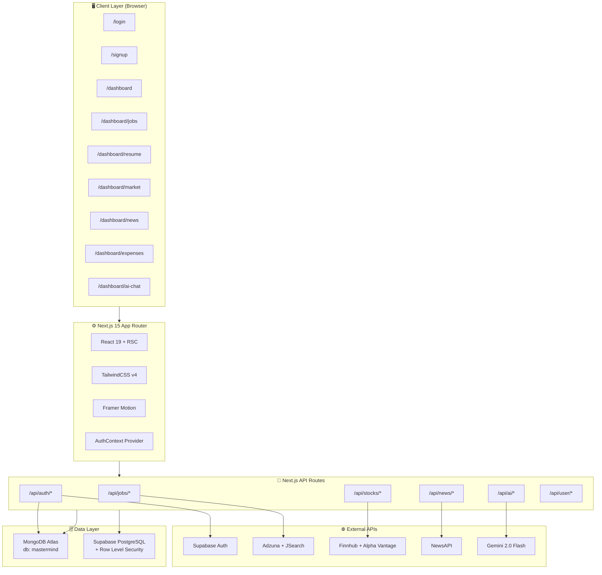

---

## 📁 Project Structure

```
mastermind-app/
│
├── 📄 package.json                    # Dependencies & npm scripts
├── 📄 next.config.ts                  # Next.js configuration
├── 📄 tsconfig.json                   # TypeScript config
├── 📄 supabase-schema.sql             # Full Supabase DB schema + RLS policies
├── 📄 .env.local                      # Environment variables (not committed)
├── 📄 .env.local.example              # Environment variable template
│
└── 📁 src/
    │
    ├── 📄 middleware.ts                # Next.js route middleware
    │
    ├── 📁 app/                         # Next.js App Router
    │   ├── 📄 layout.tsx               # Root layout (fonts, providers, chatbot)
    │   ├── 📄 page.tsx                 # Root → redirects to /login or /dashboard
    │   ├── 📄 globals.css              # Global styles + CSS variables
    │   │
    │   ├── 📁 login/                   # /login
    │   ├── 📁 signup/                  # /signup
    │   ├── 📁 forgot-password/         # /forgot-password
    │   ├── 📁 reset-password/          # /reset-password
    │   │
    │   ├── 📁 dashboard/               # Protected routes
    │   │   ├── 📄 page.tsx             # Dashboard home
    │   │   ├── 📁 jobs/                # Job Search
    │   │   ├── 📁 resume/              # Resume Builder
    │   │   ├── 📁 market/              # Stock Market
    │   │   ├── 📁 news/                # News Feed
    │   │   ├── 📁 expenses/            # Expense Tracker
    │   │   ├── 📁 ai-chat/             # AI Chat
    │   │   ├── 📁 profile/             # User Profile
    │   │   └── 📁 settings/            # App Settings
    │   │
    │   └── 📁 api/                     # Backend API Routes
    │       ├── 📁 auth/                # Authentication endpoints
    │       ├── 📁 jobs/                # Job search & save endpoints
    │       ├── 📁 stocks/              # Stock market endpoints
    │       ├── 📁 news/                # News endpoints
    │       ├── 📁 ai/                  # AI (Gemini) endpoints
    │       ├── 📁 resumes/             # Resume CRUD
    │       └── 📁 user/                # User stats & transactions
    │
    ├── 📁 components/                  # Shared UI Components
    │   ├── 📄 Chatbot.tsx              # Global floating AI chatbot
    │   ├── 📄 ActionCard.tsx           # Reusable action card
    │   ├── 📄 MatrixBackground.tsx     # Animated matrix background
    │   ├── 📁 ui/                      # Radix UI primitives
    │   │   ├── button.tsx
    │   │   ├── card.tsx
    │   │   ├── input.tsx
    │   │   ├── dialog.tsx
    │   │   ├── tabs.tsx
    │   │   └── toast.tsx
    │   └── 📁 effects/
    │       └── WaterTouchEffects.tsx   # Interactive ripple effect
    │
    ├── 📁 features/                    # Feature-based modules
    │   └── 📁 auth/
    │       └── 📁 context/
    │           └── AuthContext.tsx     # Global auth context & hooks
    │
    ├── 📁 lib/                         # Core library / business logic
    │   ├── 📄 db.ts                    # MongoDB connection (cached)
    │   ├── 📄 auth.ts                  # Auth helper utilities
    │   ├── 📄 models.ts                # Mongoose data models
    │   └── 📁 services/                # Service layer (API wrappers)
    │       ├── ai-service.ts           # Gemini AI service
    │       ├── job-service.ts          # Jobs (Adzuna/JSearch)
    │       ├── news-service.ts         # News (NewsAPI)
    │       └── stock-service.ts        # Stocks (Finnhub/Alpha Vantage)
    │
    └── 📁 shared/                      # Cross-cutting utilities
        ├── 📁 database/types.ts        # Shared TypeScript types
        ├── 📁 hooks/use-toast.ts       # Toast notification hook
        └── 📁 utils/index.ts           # formatCurrency, formatRelativeTime
```

---

## 🔄 Application Flow

```mermaid
flowchart TD
    START([🌐 User visits app]) --> ROOT[Root Page /]
    ROOT --> AUTH_CHECK{Auth State?}
    
    AUTH_CHECK -->|Not logged in| LOGIN[/login page]
    AUTH_CHECK -->|Logged in| DASH[/dashboard]

    LOGIN --> CREDS[Enter Email + Password]
    CREDS --> API_LOGIN[POST /api/auth/login]
    API_LOGIN --> MONGO_CHECK[Find user in MongoDB\nbcrypt.compare password]
    MONGO_CHECK -->|Valid| SESSION[Create Supabase Session\nSet JWT Cookie]
    MONGO_CHECK -->|Invalid| LOGIN_ERR[❌ Show error toast]
    SESSION --> DASH

    LOGIN --> SIGNUP_LINK[New user? → /signup]
    SIGNUP_LINK --> REGISTER[POST /api/auth/register]
    REGISTER --> CREATE_USER[Create MongoDB User\nbcrypt hash password\nSupabase signUp]
    CREATE_USER --> SESSION

    DASH --> PARALLEL[Promise.all — Parallel Data Loading]
    PARALLEL --> J1[Saved Jobs]
    PARALLEL --> J2[Resume Count]
    PARALLEL --> J3[Watchlist Stocks]
    PARALLEL --> J4[Transactions]
    PARALLEL --> J5[Recommended Jobs]
    PARALLEL --> J6[News Headlines]

    DASH --> NAV{User Navigates To}
    NAV -->|Jobs| MOD1[💼 /dashboard/jobs]
    NAV -->|Resume| MOD2[📄 /dashboard/resume]
    NAV -->|Market| MOD3[📈 /dashboard/market]
    NAV -->|News| MOD4[📰 /dashboard/news]
    NAV -->|Expenses| MOD5[💰 /dashboard/expenses]
    NAV -->|AI Chat| MOD6[🤖 /dashboard/ai-chat]
```

---

## 🔐 Authentication Flow

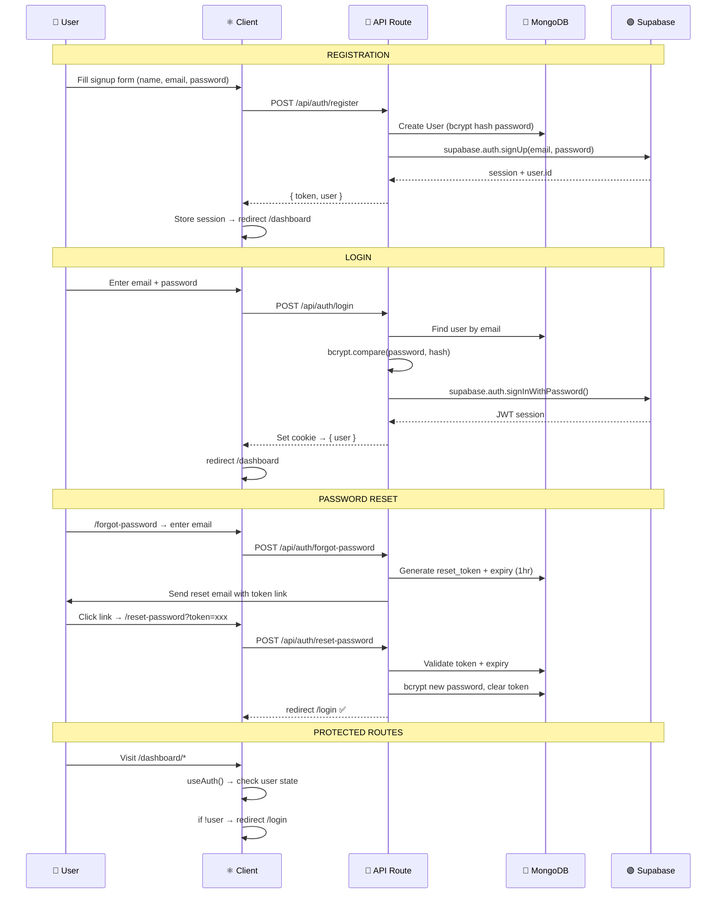

---

## 📊 Dashboard Overview

The main dashboard loads **all data in parallel** using `Promise.all()`:

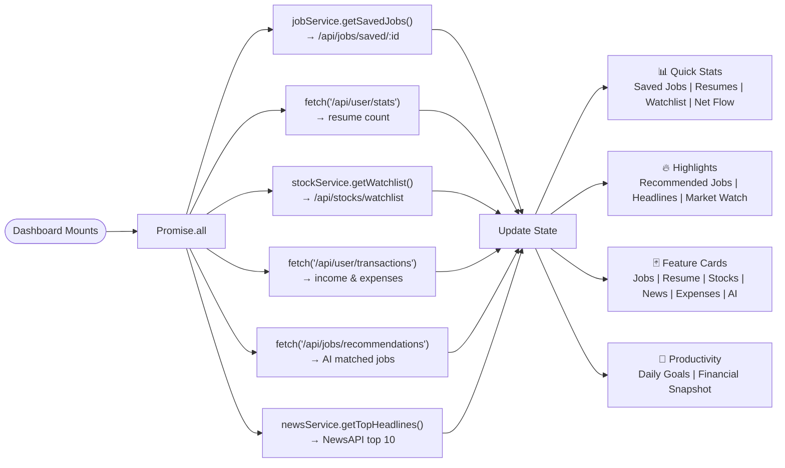

**Watchlist Fallback:** If watchlist is empty, auto-loads popular stocks: `AAPL, MSFT, GOOGL, AMZN, TSLA`

---

## 💼 Module 1 — Job Search

**Route:** `/dashboard/jobs`

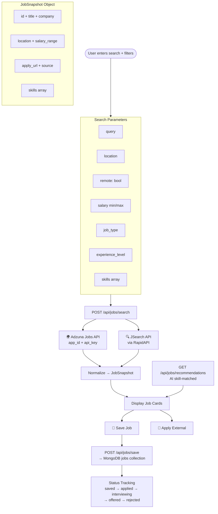

---

## 📄 Module 2 — Resume Builder

**Route:** `/dashboard/resume`

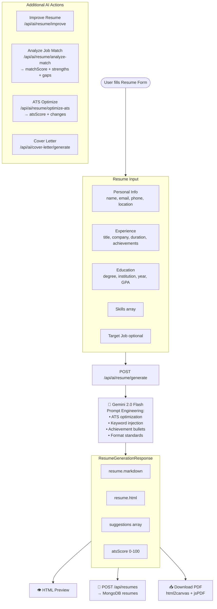

---

## 📈 Module 3 — Market Dashboard

**Route:** `/dashboard/market`

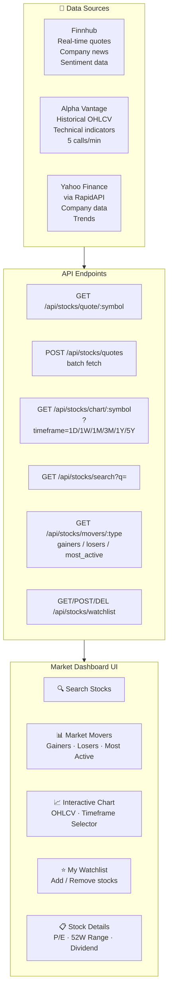

**StockQuote Object:** `symbol · name · price · change · changePercent · volume · marketCap · pe · high52Week · low52Week · dividend`

---

## 📰 Module 4 — News Feed

**Route:** `/dashboard/news`

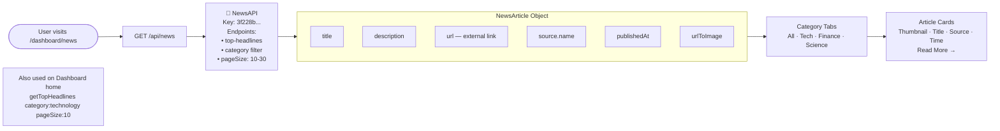

---

## 💰 Module 5 — Expense Tracker

**Route:** `/dashboard/expenses`

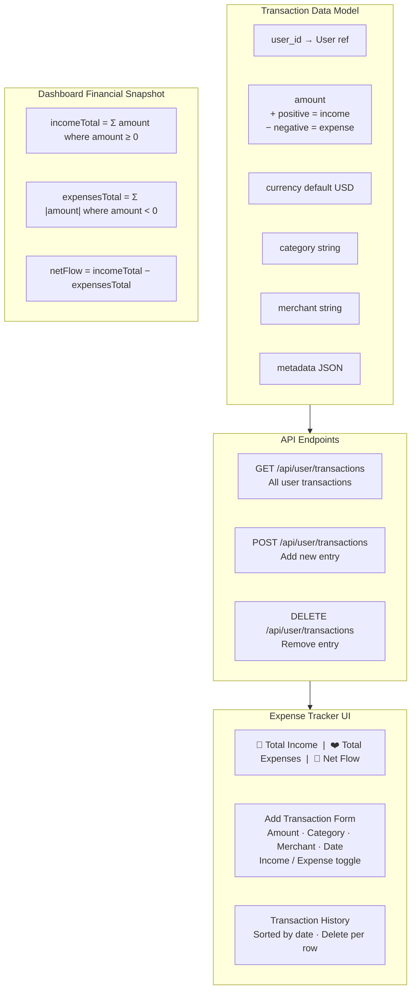

---

## 🤖 Module 6 — AI Assistant

**Routes:** `/dashboard/ai-chat` + Global Floating Chatbot

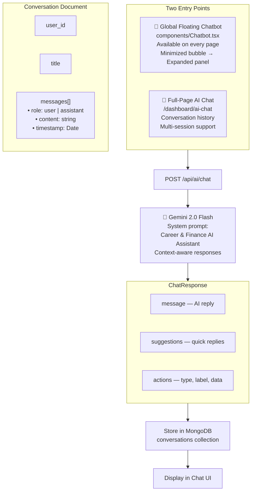

---

## 🗄️ Database Architecture

### MongoDB Atlas — Primary Store

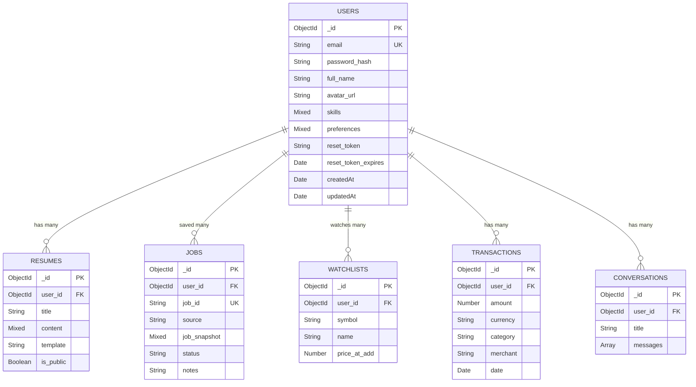

### Supabase PostgreSQL — Auth + Mirror with RLS

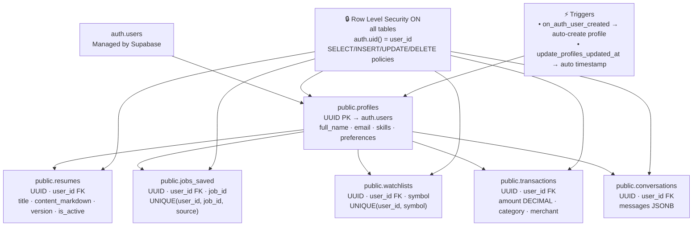

---

## 🔌 API Reference

### Authentication

| Method | Endpoint | Description | Body |
|--------|----------|-------------|------|
| `POST` | `/api/auth/register` | Register new user | `{ name, email, password }` |
| `POST` | `/api/auth/login` | Login | `{ email, password }` |
| `POST` | `/api/auth/logout` | Logout | — |
| `GET` | `/api/auth/me` | Current user | — |
| `POST` | `/api/auth/forgot-password` | Send reset email | `{ email }` |
| `POST` | `/api/auth/reset-password` | Reset password | `{ token, newPassword }` |

### Jobs

| Method | Endpoint | Description |
|--------|----------|-------------|
| `POST` | `/api/jobs/search` | Search live jobs |
| `GET` | `/api/jobs/recommendations` | AI-matched job list |
| `GET` | `/api/jobs/saved/:userId` | Get saved jobs |
| `POST` | `/api/jobs/save` | Save a job |
| `DELETE` | `/api/jobs/saved/:userId/:source/:jobId` | Remove saved job |

### Stocks

| Method | Endpoint | Description |
|--------|----------|-------------|
| `GET` | `/api/stocks/quote/:symbol` | Single stock quote |
| `POST` | `/api/stocks/quotes` | Batch quotes `{ symbols[] }` |
| `GET` | `/api/stocks/chart/:symbol?timeframe=` | OHLCV chart data |
| `GET` | `/api/stocks/search?q=` | Search by name/symbol |
| `GET` | `/api/stocks/movers/:type` | gainers / losers / most_active |
| `GET` | `/api/stocks/news/:symbol` | Stock-specific news |
| `GET/POST/DELETE` | `/api/stocks/watchlist` | Manage watchlist |

### AI

| Method | Endpoint | Description |
|--------|----------|-------------|
| `POST` | `/api/ai/chat` | Gemini chat response |
| `POST` | `/api/ai/resume/generate` | Generate full resume |
| `POST` | `/api/ai/resume/improve` | Improve existing resume |
| `POST` | `/api/ai/resume/analyze-match` | Job match score + gaps |
| `POST` | `/api/ai/resume/optimize-ats` | ATS optimization |
| `POST` | `/api/ai/cover-letter/generate` | Generate cover letter |

### User

| Method | Endpoint | Description |
|--------|----------|-------------|
| `GET` | `/api/user/stats` | Summary counts (resumes, etc.) |
| `GET` | `/api/user/transactions` | All transactions |
| `POST` | `/api/user/transactions` | Add transaction |

---

## 🧩 Component Architecture

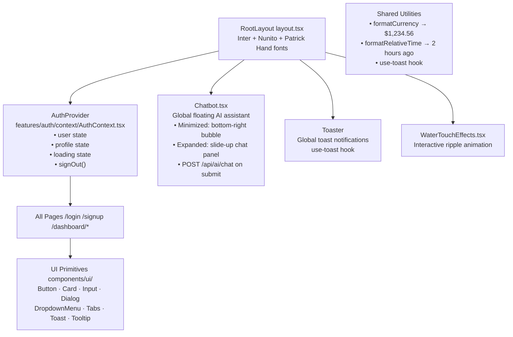

---

## 🔑 Environment Variables

Create `.env.local` inside `mastermind-app/`:

```env
# MongoDB
MONGODB_URI=mongodb+srv://<user>:<pass>@cluster.mongodb.net/mastermind

# Supabase
NEXT_PUBLIC_SUPABASE_URL=https://xxxx.supabase.co
NEXT_PUBLIC_SUPABASE_ANON_KEY=your_supabase_anon_key
SUPABASE_SERVICE_ROLE_KEY=your_supabase_service_role_key

# AI — Google Gemini 2.0 Flash
GEMINI_API_KEY=your_gemini_api_key

# Stock Market
NEXT_PUBLIC_FINNHUB_API_KEY=your_finnhub_key
NEXT_PUBLIC_ALPHA_VANTAGE_API_KEY=your_alpha_vantage_key
NEXT_PUBLIC_YAHOO_FINANCE_API_KEY=your_yahoo_rapidapi_key

# Jobs
NEXT_PUBLIC_ADZUNA_APP_ID=your_adzuna_app_id
NEXT_PUBLIC_ADZUNA_API_KEY=your_adzuna_api_key
NEXT_PUBLIC_JSEARCH_API_KEY=your_jsearch_rapidapi_key

# News
NEWS_API_KEY=your_newsapi_key

# Auth
JWT_SECRET=your_strong_jwt_secret
NEXTAUTH_SECRET=your_nextauth_secret
NEXTAUTH_URL=http://localhost:3000
```

> Copy `.env.local.example` as your starting template.

---

## 🚀 Getting Started

### Prerequisites

| Requirement | Version |
|-------------|---------|
| Node.js | 18.x or higher |
| npm | 9.x or higher |
| MongoDB Atlas | Free tier works |
| Supabase account | Free tier works |

### Installation

```bash
# 1. Clone the repository
git clone https://github.com/gobinath-sketch/Final-Mastermind.git
cd Final-Mastermind/mastermind-app

# 2. Install all dependencies
npm install

# 3. Set up environment variables
cp .env.local.example .env.local
# Edit .env.local with your actual keys

# 4. Set up Supabase database
# → Go to Supabase project → SQL Editor
# → Paste and run: supabase-schema.sql

# 5. Start the development server
npm run dev
# Opens at http://localhost:3000
```

### Production Build

```bash
npm run build
npm start
```

### Available Scripts

| Script | Description |
|--------|-------------|
| `npm run dev` | Start dev server (auto-opens browser) |
| `npm run dev:base` | Start Next.js dev server only |
| `npm run build` | Build for production |
| `npm start` | Start production server |
| `npm run lint` | Run ESLint |

---

## 🛠️ Tech Stack

### Frontend

| Technology | Version | Purpose |
|-----------|---------|---------|
| **Next.js** | 15.x | Full-stack React framework (App Router) |
| **React** | 19.x | UI library |
| **TypeScript** | 5.x | Type safety |
| **TailwindCSS** | 4.x | Utility-first CSS |
| **Framer Motion** | 12.x | Animations & transitions |
| **Recharts** | 3.x | Stock charts & data visualization |
| **Chart.js** | 4.x | Additional charting |
| **Radix UI** | latest | Accessible UI primitives |
| **Lucide React** | 0.544 | Icon library |

### Backend

| Technology | Version | Purpose |
|-----------|---------|---------|
| **Next.js API Routes** | 15.x | Serverless backend |
| **MongoDB Atlas** | — | Primary data store |
| **Mongoose** | 9.x | MongoDB ODM |
| **Supabase** | latest | Auth + PostgreSQL mirror |
| **bcryptjs** | 3.x | Password hashing |
| **jsonwebtoken** | 9.x | JWT auth tokens |

### External APIs & AI

| Service | Purpose |
|---------|---------|
| **Gemini 2.0 Flash** | AI chatbot + resume generation |
| **Finnhub** | Real-time stock quotes & news |
| **Alpha Vantage** | Historical stock data |
| **Yahoo Finance (RapidAPI)** | Company data & trends |
| **Adzuna** | Live job listings |
| **JSearch (RapidAPI)** | Real-time job search |
| **NewsAPI** | Technology & career news |

### Developer Tools

| Tool | Purpose |
|------|---------|
| **ESLint** | Code linting |
| **html2canvas + jsPDF** | Client-side PDF export |
| **date-fns** | Date formatting utilities |
| **zod** | Schema validation |
| **react-hook-form** | Form state management |

---

<div align="center">

---

**Built with ❤️ by [Gobinath](https://github.com/gobinath-sketch)**

*Mastermind — AI-Powered · Real-Time · Full-Stack · Production-Ready*

</div>
