<div align="center">

# 𝘚𝘱𝘩𝘪𝘯𝘹

### *Your All-in-One AI-Powered Career & Finance Intelligence Platform*

[](https://nextjs.org/)
[](https://reactjs.org/)
[](https://www.typescriptlang.org/)
[](https://www.mongodb.com/)
[](https://supabase.com/)
[](https://tailwindcss.com/)
[](https://huggingface.co/meta-llama/Meta-Llama-3-8B-Instruct)
[](https://ai.google.dev/)

<br/>

> **Mastermind** is a production-grade, full-stack web platform that unifies **job search**, **AI-powered resume building**, **real-time stock market tracking**, **personalized news**, **expense management**, and an **intelligent AI chatbot** — all in one beautiful, responsive interface.

</div>

---

##  Table of Contents

- [ Overview](#-overview)
- [ System Architecture](#️-system-architecture)
- [ Project Structure](#-project-structure)
- [ Application Flow](#-application-flow)
- [ Authentication Flow](#-authentication-flow)
- [ Dashboard Overview](#-dashboard-overview)
- [ Module 1 — Job Search](#-module-1--job-search)
- [ Module 2 — Resume Builder](#-module-2--resume-builder)
- [ Module 3 — Market Dashboard](#-module-3--market-dashboard)
- [ Module 4 — News Feed](#-module-4--news-feed)
- [ Module 5 — Expense Tracker](#-module-5--expense-tracker)
- [ Module 6 — Atlas AI Chatbot](#-module-6--atlas-ai-chatbot)
- [ Database Architecture](#️-database-architecture)
- [ API Reference](#-api-reference)
- [ Component Architecture](#-component-architecture)
- [ Environment Variables](#-environment-variables)
- [ Getting Started](#-getting-started)
- [ Tech Stack](#️-tech-stack)

---

##  Overview

**Mastermind** solves the fragmented problem of career management and financial tracking by bringing everything together into one intelligent platform.

| Module | Description |
|--------|-------------|
|  **Auth System** | Secure login / signup / password reset via Supabase Auth + MongoDB profiles |
|  **Job Search** | Live job listings via Adzuna + JSearch APIs with AI-matched recommendations |
|  **Resume Builder** | ATS-friendly resumes generated by Gemini 2.0 Flash with PDF export |
|  **Market Dashboard** | Real-time stock quotes, charts, watchlist & portfolio via Finnhub + Alpha Vantage |
|  **News Feed** | Personalized tech/career news via NewsAPI |
|  **Expense Tracker** | Full income/expense management with financial snapshots |
|  **Atlas AI Chatbot** | Hugging Face Serverless Inference · `meta-llama/Meta-Llama-3-8B-Instruct` · 9-language support |
|  **Daily Goals** | LocalStorage-persisted goal tracker for daily productivity |

---

##  System Architecture

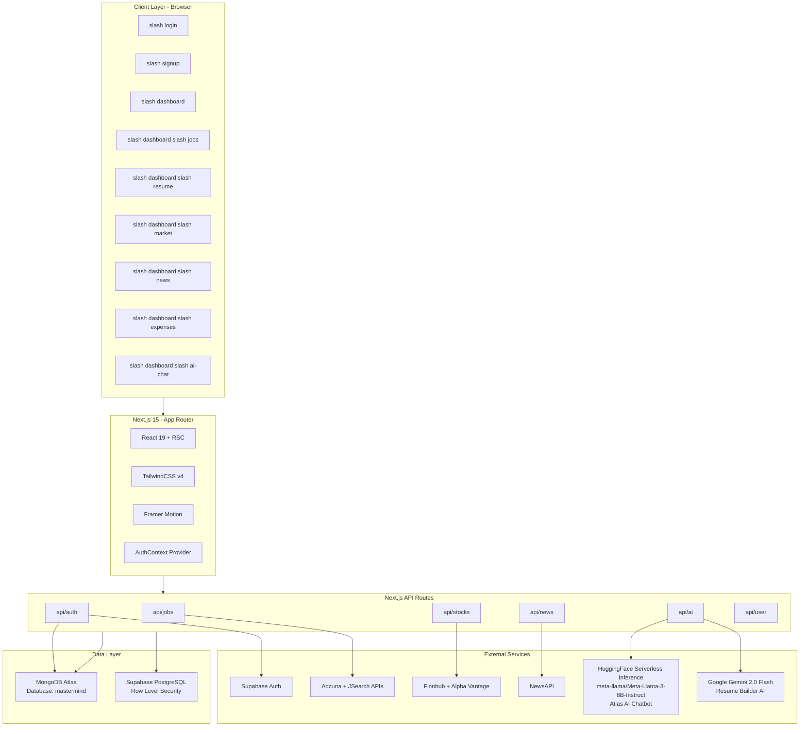

---

##  Project Structure

```
mastermind-app/
│
├── package.json                       # Dependencies & npm scripts
├── next.config.ts                     # Next.js configuration
├── tsconfig.json                      # TypeScript config
├── supabase-schema.sql                # Full Supabase DB schema + RLS
├── .env.local                         # Environment variables (not committed)
├── .env.local.example                 # Environment variable template
│
└── src/
    │
    ├── middleware.ts                   # Next.js route middleware
    │
    ├── app/                           # Next.js App Router (Pages)
    │   ├── layout.tsx                 # Root layout (fonts, providers, chatbot)
    │   ├── page.tsx                   # Root: redirects to /login or /dashboard
    │   ├── globals.css                # Global styles + CSS design tokens
    │   │
    │   ├── login/                     # /login  — Login page
    │   ├── signup/                    # /signup — Sign-up page
    │   ├── forgot-password/           # /forgot-password — Request reset
    │   ├── reset-password/            # /reset-password — New password form
    │   │
    │   ├── dashboard/                 # Protected dashboard routes
    │   │   ├── page.tsx               # Dashboard home (command center)
    │   │   ├── jobs/                  # /dashboard/jobs — Job Search
    │   │   ├── resume/                # /dashboard/resume — Resume Builder
    │   │   ├── market/                # /dashboard/market — Stock Market
    │   │   ├── news/                  # /dashboard/news — News Feed
    │   │   ├── expenses/              # /dashboard/expenses — Expense Tracker
    │   │   ├── ai-chat/               # /dashboard/ai-chat — Full AI Chat
    │   │   ├── profile/               # /dashboard/profile — User Profile
    │   │   └── settings/              # /dashboard/settings — App Settings
    │   │
    │   └── api/                       # Backend API Routes (serverless)
    │       ├── auth/                  # login, register, logout, me, reset
    │       ├── jobs/                  # search, save, saved, recommendations
    │       ├── stocks/                # quote, quotes, chart, watchlist, movers
    │       ├── news/                  # headlines, categories
    │       ├── ai/                    # chat (HuggingFace) + resume (Gemini)
    │       ├── resumes/               # CRUD for saved resumes
    │       └── user/                  # stats, transactions
    │
    ├── components/                    # Shared UI Components
    │   ├── Chatbot.tsx                # Atlas AI — global floating chatbot
    │   ├── ActionCard.tsx             # Reusable action card component
    │   ├── MatrixBackground.tsx       # Animated matrix background effect
    │   ├── ui/                        # Radix UI primitives
    │   │   ├── button.tsx
    │   │   ├── card.tsx
    │   │   ├── input.tsx
    │   │   ├── dialog.tsx
    │   │   ├── tabs.tsx
    │   │   └── toast.tsx
    │   └── effects/
    │       └── WaterTouchEffects.tsx  # Interactive water ripple effect
    │
    ├── features/                      # Feature modules
    │   └── auth/
    │       └── context/
    │           └── AuthContext.tsx    # Global auth state (user, profile, signOut)
    │
    ├── lib/                           # Core business logic
    │   ├── db.ts                      # MongoDB connection (cached singleton)
    │   ├── auth.ts                    # JWT verify helpers
    │   ├── models.ts                  # Mongoose schemas & models
    │   └── services/                  # Client-side API service wrappers
    │       ├── ai-service.ts          # Chat + resume AI client wrappers
    │       ├── job-service.ts         # Job search & save (Adzuna/JSearch)
    │       ├── news-service.ts        # News headlines (NewsAPI)
    │       └── stock-service.ts       # Stocks, watchlist (Finnhub/AlphaVantage)
    │
    └── shared/                        # Cross-cutting utilities
        ├── database/types.ts          # Shared TypeScript interfaces
        ├── hooks/use-toast.ts         # Global toast notification hook
        └── utils/index.ts             # formatCurrency, formatRelativeTime
```

---

##  Application Flow

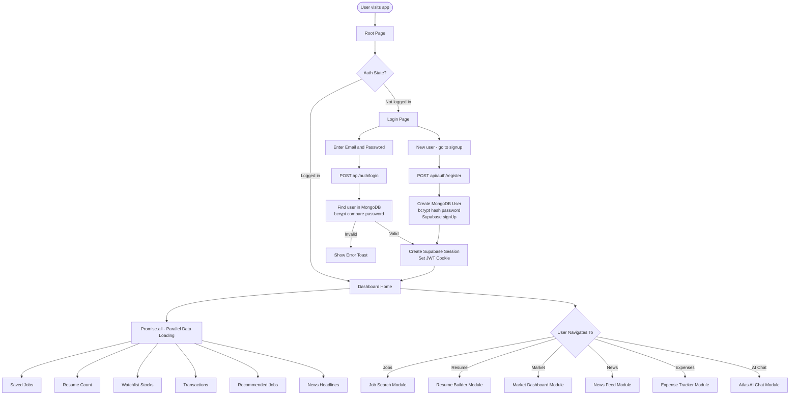

---

##  Authentication Flow

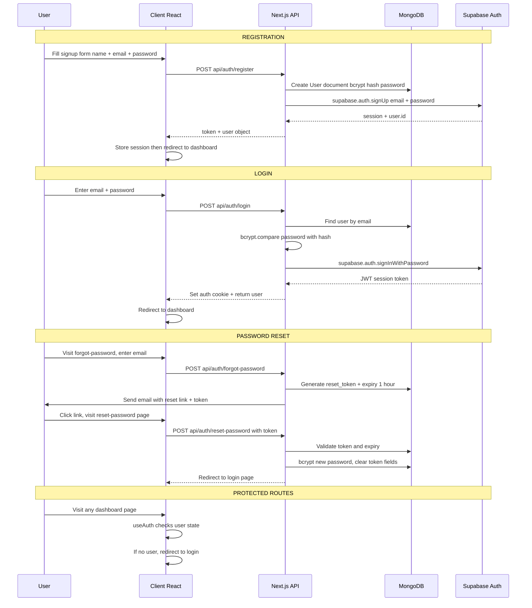

---

##  Dashboard Overview

The main dashboard loads **all data in parallel** using `Promise.all()`:

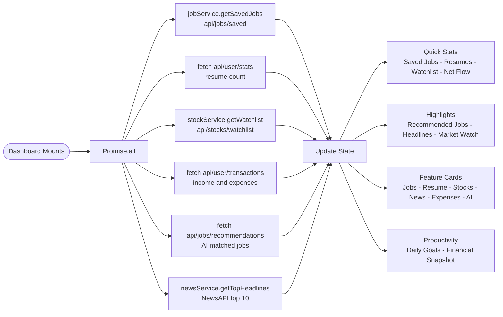

> **Watchlist Fallback:** If watchlist is empty, auto-loads popular stocks: `AAPL, MSFT, GOOGL, AMZN, TSLA`

---

##  Module 1 — Job Search

**Route:** `/dashboard/jobs`

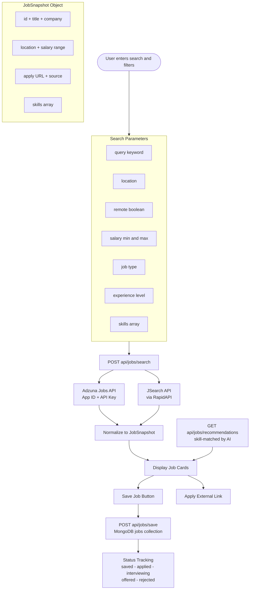

---

##  Module 2 — Resume Builder

**Route:** `/dashboard/resume`

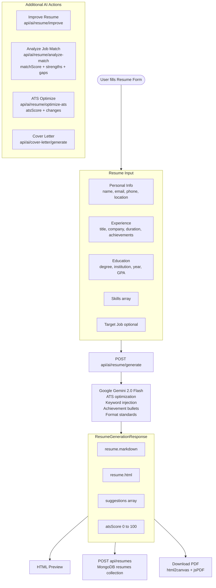

---

##  Module 3 — Market Dashboard

**Route:** `/dashboard/market`

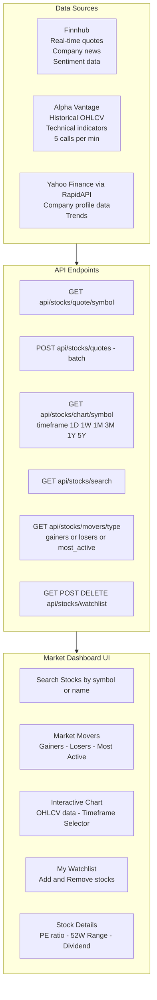

**StockQuote fields:** `symbol · name · price · change · changePercent · volume · marketCap · pe · high52Week · low52Week · dividend`

---

##  Module 4 — News Feed

**Route:** `/dashboard/news`

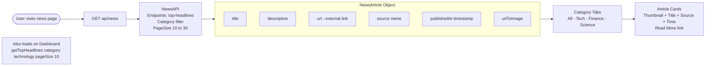

---

##  Module 5 — Expense Tracker

**Route:** `/dashboard/expenses`

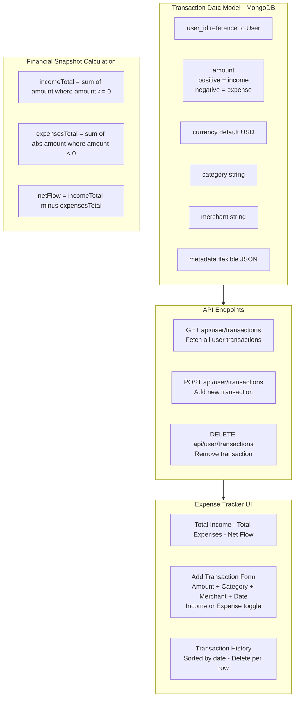

---

##  Module 6 — Atlas AI Chatbot

**Routes:** `/dashboard/ai-chat` + Global Floating Chatbot (named **Atlas AI**)

> **Powered by:** [Hugging Face Serverless Inference](https://huggingface.co/inference-api) · Model: `meta-llama/Meta-Llama-3-8B-Instruct` · Temperature: `0.6` · Max tokens: `800`

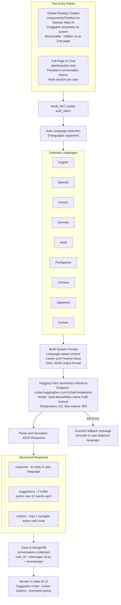

### Atlas AI — Technical Specification

| Property | Detail |
|----------|--------|
| **Chatbot Name** | Atlas AI |
| **API Provider** | Hugging Face Serverless Inference |
| **API Endpoint** | `https://router.huggingface.co/v1/chat/completions` |
| **Model** | `meta-llama/Meta-Llama-3-8B-Instruct` |
| **Temperature** | `0.6` |
| **Max Tokens** | `800` |
| **Languages** | 9 — auto-detected via Unicode ranges + keyword matching |
| **Auth** | JWT cookie `auth_token` verified server-side on every request |
| **Response Format** | Strict JSON: `{ response, suggestions[], actions[] }` |
| **Storage** | MongoDB `conversations` collection — persistent per user |
| **Fallback** | Error message returned in user's detected language |
| **UI Features** | Draggable · Minimizable · Suggestion chips · Action buttons |

---

##  Database Architecture

### MongoDB Atlas — Primary Store


### Supabase PostgreSQL — Auth + RLS Mirror

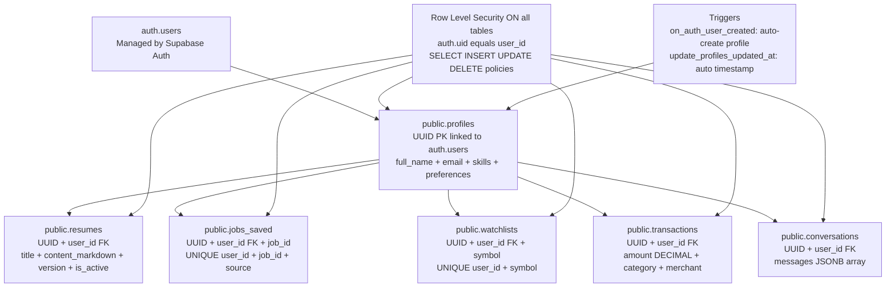

---

## 🔌 API Reference

### Authentication

| Method | Endpoint | Description | Body |
|--------|----------|-------------|------|
| `POST` | `/api/auth/register` | Register new user | `{ name, email, password }` |
| `POST` | `/api/auth/login` | Login | `{ email, password }` |
| `POST` | `/api/auth/logout` | Logout | — |
| `GET` | `/api/auth/me` | Current user | — |
| `POST` | `/api/auth/forgot-password` | Send reset email | `{ email }` |
| `POST` | `/api/auth/reset-password` | Reset password | `{ token, newPassword }` |

### Jobs

| Method | Endpoint | Description |
|--------|----------|-------------|
| `POST` | `/api/jobs/search` | Search live jobs |
| `GET` | `/api/jobs/recommendations` | AI skill-matched job list |
| `GET` | `/api/jobs/saved/:userId` | Get saved jobs |
| `POST` | `/api/jobs/save` | Save a job |
| `DELETE` | `/api/jobs/saved/:userId/:source/:jobId` | Remove saved job |

### Stocks

| Method | Endpoint | Description |
|--------|----------|-------------|
| `GET` | `/api/stocks/quote/:symbol` | Single stock quote |
| `POST` | `/api/stocks/quotes` | Batch quotes `{ symbols[] }` |
| `GET` | `/api/stocks/chart/:symbol?timeframe=` | OHLCV chart data |
| `GET` | `/api/stocks/search?q=` | Search by name or symbol |
| `GET` | `/api/stocks/movers/:type` | gainers / losers / most_active |
| `GET` | `/api/stocks/news/:symbol` | Stock-specific news |
| `GET/POST/DELETE` | `/api/stocks/watchlist` | Manage watchlist |

### AI

| Method | Endpoint | Description |
|--------|----------|-------------|
| `POST` | `/api/ai/chat` | **Atlas AI** — HuggingFace `meta-llama/Meta-Llama-3-8B-Instruct` |
| `POST` | `/api/ai/resume/generate` | Generate resume — **Gemini 2.0 Flash** |
| `POST` | `/api/ai/resume/improve` | Improve existing resume |
| `POST` | `/api/ai/resume/analyze-match` | Job match score + gaps |
| `POST` | `/api/ai/resume/optimize-ats` | ATS optimization + score |
| `POST` | `/api/ai/cover-letter/generate` | Generate cover letter |

### User

| Method | Endpoint | Description |
|--------|----------|-------------|
| `GET` | `/api/user/stats` | Summary counts — resumes, jobs |
| `GET` | `/api/user/transactions` | All transactions |
| `POST` | `/api/user/transactions` | Add transaction |

---

##  Component Architecture

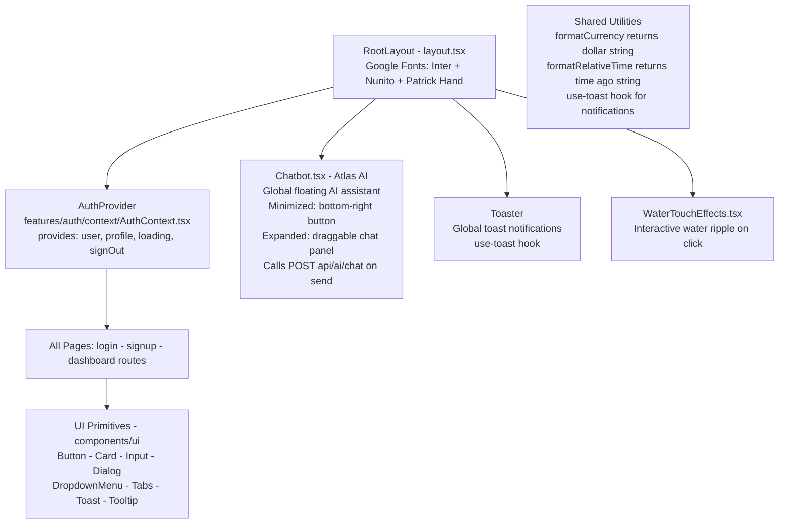

---

##  Environment Variables

Create `.env.local` inside `mastermind-app/`:

```env
# ── MongoDB ────────────────────────────────────────────────────────────
MONGODB_URI=mongodb+srv://<user>:<pass>@cluster.mongodb.net/mastermind

# ── Supabase ───────────────────────────────────────────────────────────
NEXT_PUBLIC_SUPABASE_URL=https://xxxx.supabase.co
NEXT_PUBLIC_SUPABASE_ANON_KEY=your_supabase_anon_key
SUPABASE_SERVICE_ROLE_KEY=your_supabase_service_role_key

# ── Atlas AI Chatbot — Hugging Face Serverless Inference ──────────────
# Model:    meta-llama/Meta-Llama-3-8B-Instruct
# Endpoint: https://router.huggingface.co/v1/chat/completions
HUGGINGFACE_API_KEY=your_huggingface_api_key
# Legacy aliases also accepted by the code:
# OPENROUTER_API_KEY=your_key
# OPEN_ROUTER_API_KEY=your_key
# NEXT_PUBLIC_OPENROUTER_API_KEY=your_key

# ── Resume Builder AI — Google Gemini 2.0 Flash ───────────────────────
GEMINI_API_KEY=your_gemini_2_flash_api_key

# ── Stock Market APIs ─────────────────────────────────────────────────
NEXT_PUBLIC_FINNHUB_API_KEY=your_finnhub_key
NEXT_PUBLIC_ALPHA_VANTAGE_API_KEY=your_alpha_vantage_key
NEXT_PUBLIC_YAHOO_FINANCE_API_KEY=your_yahoo_rapidapi_key

# ── Jobs APIs ─────────────────────────────────────────────────────────
NEXT_PUBLIC_ADZUNA_APP_ID=your_adzuna_app_id
NEXT_PUBLIC_ADZUNA_API_KEY=your_adzuna_api_key
NEXT_PUBLIC_JSEARCH_API_KEY=your_jsearch_rapidapi_key

# ── News API ──────────────────────────────────────────────────────────
NEWS_API_KEY=your_newsapi_key

# ── Auth ──────────────────────────────────────────────────────────────
JWT_SECRET=your_strong_jwt_secret_min_32_chars
NEXTAUTH_SECRET=your_nextauth_secret
NEXTAUTH_URL=http://localhost:3000
```

> Copy `.env.local.example` as your starting template.

---

##  Getting Started

### Prerequisites

| Requirement | Version |
|-------------|---------|
| Node.js | 18.x or higher |
| npm | 9.x or higher |
| MongoDB Atlas | Free tier works |
| Supabase account | Free tier works |
| API Keys | See environment variables section |

### Installation

```bash
# 1. Clone the repository
git clone https://github.com/gobinath-sketch/Final-Mastermind.git
cd Final-Mastermind/mastermind-app

# 2. Install all dependencies
npm install

# 3. Set up environment variables
cp .env.local.example .env.local
# Edit .env.local and fill in all your API keys

# 4. Set up Supabase database
# Go to Supabase Dashboard > SQL Editor
# Paste and run the contents of: supabase-schema.sql

# 5. Start the development server
npm run dev
# App opens at http://localhost:3000
```

### Production Build

```bash
npm run build
npm start
```

### Available Scripts

| Script | Description |
|--------|-------------|
| `npm run dev` | Start dev server (auto-opens browser) |
| `npm run dev:base` | Start Next.js dev server only |
| `npm run build` | Build production bundle |
| `npm start` | Start production server |
| `npm run lint` | Run ESLint checks |

---

##  Tech Stack

### Frontend

| Technology | Version | Purpose |
|-----------|---------|---------|
| **Next.js** | 15.x | Full-stack framework with App Router |
| **React** | 19.x | UI library |
| **TypeScript** | 5.x | Static type safety |
| **TailwindCSS** | 4.x | Utility-first CSS framework |
| **Framer Motion** | 12.x | Animations and transitions |
| **Recharts** | 3.x | Stock charts and data visualization |
| **Chart.js** | 4.x | Additional charting |
| **Radix UI** | latest | Accessible headless UI primitives |
| **Lucide React** | 0.544 | Icon library |
| **Google Fonts** | — | Inter · Nunito · Patrick Hand |

### Backend

| Technology | Version | Purpose |
|-----------|---------|---------|
| **Next.js API Routes** | 15.x | Serverless backend endpoints |
| **MongoDB Atlas** | — | Primary data store |
| **Mongoose** | 9.x | MongoDB object document mapper |
| **Supabase** | latest | Auth provider + PostgreSQL mirror |
| **bcryptjs** | 3.x | Password hashing |
| **jsonwebtoken** | 9.x | JWT generation and verification |

### External APIs & AI

| Service | Model / Plan | Purpose |
|---------|-------------|---------|
| **Hugging Face Serverless** | `meta-llama/Meta-Llama-3-8B-Instruct` | **Atlas AI Chatbot** — 9-language career & finance assistant |
| **Google Gemini** | `gemini-2.0-flash` | Resume generation · ATS optimization · Cover letter · Job match |
| **Finnhub** | Free plan | Real-time stock quotes · Company news · Sentiment |
| **Alpha Vantage** | Free — 5 calls/min | Historical OHLCV data · Technical indicators |
| **Yahoo Finance** | via RapidAPI | Company profiles · Stock trends |
| **Adzuna** | Free — limited | Live job listings worldwide |
| **JSearch** | via RapidAPI | Real-time job search · Salary data |
| **NewsAPI** | Free plan | Technology and career news headlines |

### Developer Tools

| Tool | Purpose |
|------|---------|
| **ESLint** | Code quality linting |
| **html2canvas** | DOM to image for PDF generation |
| **jsPDF** | Client-side PDF export |
| **date-fns** | Date formatting utilities |
| **zod** | Runtime schema validation |
| **react-hook-form** | Form state management |

---

<div align="center">

---

**Built by [Gobinath](https://github.com/gobinath-sketch)**

*𝘚𝘱𝘩𝘪𝘯𝘹 — AI-Powered · Real-Time · Full-Stack · Production-Ready*

</div>
